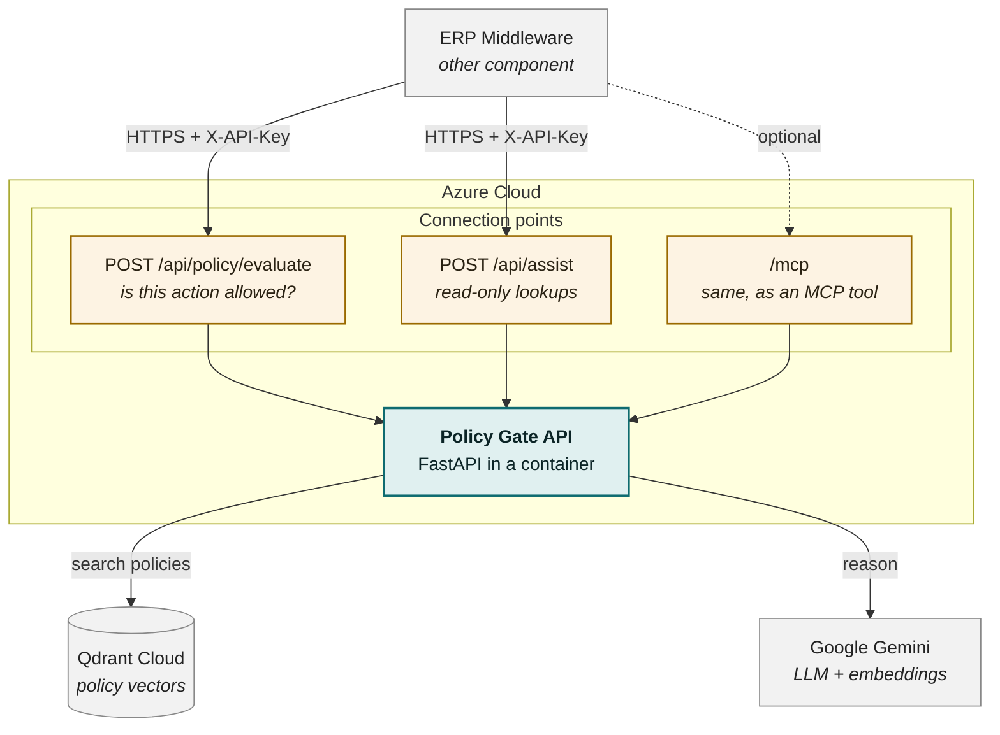

# Deployment — AI Decision Module (RAG + LLM)

Scope: **this component only.** The ERP frontend, the middleware/agent loop, and
the data-transport layer are other developers' components and appear here only
as the callers and data sources this module talks to.

Verified against the live deployment on 2026-08-28.

---

## Deployment diagram

**In one line:** the ERP middleware calls one of our endpoints over HTTPS; our
API searches policies in Qdrant and reasons with Gemini, then returns a decision.

### Where the other component connects

| Endpoint | Use it when | Returns |
|---|---|---|
| `POST /api/policy/evaluate` | The user wants to **do** something — pay, approve, post | `allow` / `allow_with_conditions` / `deny` / `review` |
| `POST /api/assist` | The user wants to **look something up** | A plan of read-tools to run, or an answer |
| `POST /api/policy/actions` | Building the action mapping | The action names this gate recognises |
| `GET /health` | Monitoring | Service + corpus status (no auth needed) |
| `/mcp` | Optional — if the caller speaks MCP | Tool `check_policy`, same result as `/evaluate` |

All except `/health` need the header `X-API-Key: <key>`.
Base URL and key come from the deployment owner.

---

## Nodes

| Node | What runs there | Notes |
|---|---|---|
| **Container App `policy-gate`** | The whole decision module | Serverless, scale-to-zero (0–1 replicas), external HTTPS ingress, target port 8000 |
| **Container image** | `python:3.13-slim` + app | ~567 MB. **No model weights, no GPU** — that is what makes a small container viable |
| **Qdrant Cloud** | Policy + record vectors | Two collections kept structurally separate so no query bug can feed a company record to the judge as a rule |
| **Google Gemini** | LLM + embeddings | Reached over HTTPS via the OpenAI-compatible endpoint; no model is hosted by this component |
| **ACR** | Image registry | Build-time only. Image built on the dev workstation and pushed (ACR Tasks is blocked on this subscription) |

---

## Tools and technologies

| Layer | Tool |
|---|---|
| Language / runtime | Python 3.13 |
| Web framework | FastAPI + Uvicorn (ASGI) |
| Data models / config | Pydantic v2, pydantic-settings |
| LLM orchestration | LangChain (`langchain-openai`, `langchain-ollama`) |
| Vector store client | `qdrant-client`, `langchain-qdrant` |
| Chunking | `langchain-text-splitters` (baseline comparison only — the gate uses clause-aware chunking) |
| Agent protocol | `mcp` — MCP server mounted at `/mcp` |
| Container | Docker (`python:3.13-slim`), non-root user |
| Hosting | Azure Container Apps + Azure Container Registry |
| Vector DB | Qdrant Cloud (managed) |
| LLM / embeddings | Google Gemini (`gemini-3.5-flash-lite`, `gemini-embedding-001`) |
| Local alternative | Ollama (`MODEL_PROVIDER=ollama`) — offline runs, needs a 768-d re-seed |

---

## Communication paths

| From → To | Protocol | Purpose |
|---|---|---|
| Caller → `policy-gate` | HTTPS, `X-API-Key` header | Policy decisions and read-tool plans |
| Caller (MCP client) → `/mcp` | HTTPS streamable transport, `X-API-Key` | Same decision exposed as tool `check_policy` |
| `policy-gate` → Qdrant Cloud | HTTPS + API key | Three-query union: mandatory filter, action filter, vector top-k |
| `policy-gate` → Gemini | HTTPS + API key | Intent extraction, judging, assist planning, embeddings |
| ACR → Container App | Azure-internal image pull | Registry admin credentials, stored as a Container App secret |

---

## Runtime configuration

Secrets are Container App secrets, referenced as `secretref:` env vars — never
baked into the image:

| Secret | Env var | Used for |
|---|---|---|
| `gate-key` | `API_KEYS` | Inbound auth — validates callers |
| `api-key` | `API_KEY` | Outbound auth to Gemini |
| `qdrant-key` | `QDRANT_API_KEY` | Outbound auth to Qdrant Cloud |

`PORT` is injected by the platform; the container binds `${PORT:-8000}`.

---

## What is deliberately *not* deployed here

- **No corpus seeding on boot.** Seeding writes to a shared Qdrant collection; a
  container that re-seeds on start would rewrite the corpus on every scale-out.
  Run `python -m scripts.seed_qdrant_policies --recreate` once, from anywhere.
- **No ERP database, no execution path.** This component decides; the caller
  executes. It holds no credentials to any system of record.
- **No local model.** Moving inference to a hosted API is what removed the GPU
  and multi-GB memory requirement.
